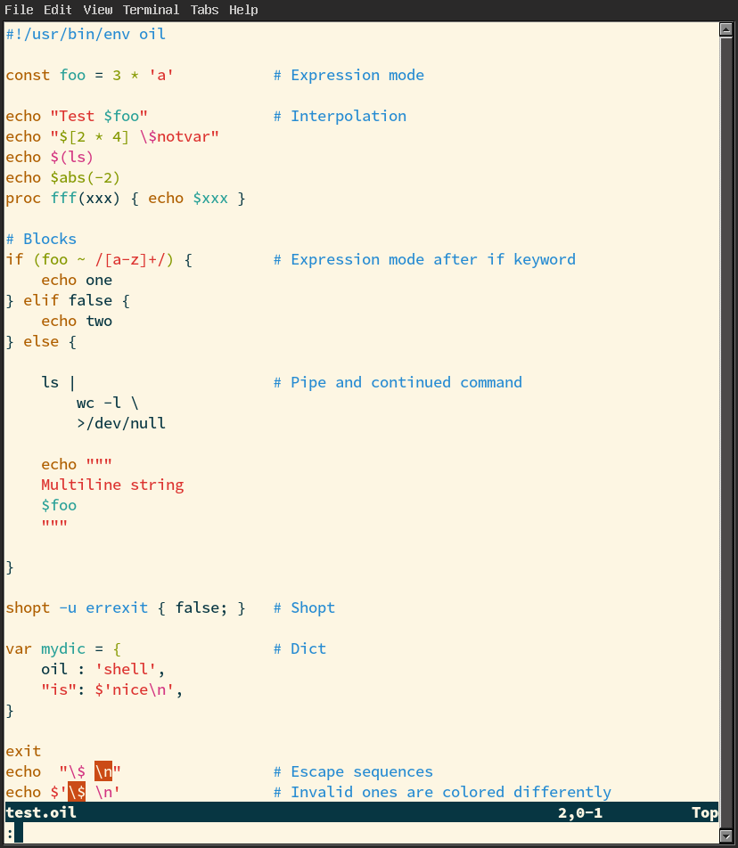

# Oil syntax and indentation support for Vim

## Features
- Syntax highlighting of variables, comments, strings, escape sequences, expression mode etc.
- Indentation of blocks, pipes, dicts, multiline strings etc.
- Filetype detection
- Tested on neovim 0.7.0 (should work on vim too)



## Installation
If you use vim-plug:
```
Plug 'glyh/vim-oil'
```
Should work with other package managers as well.

